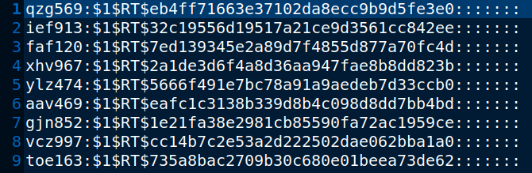
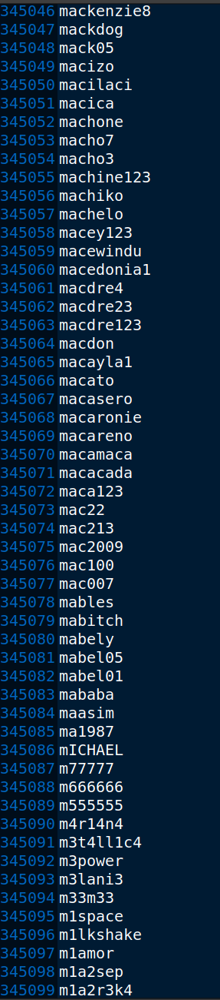
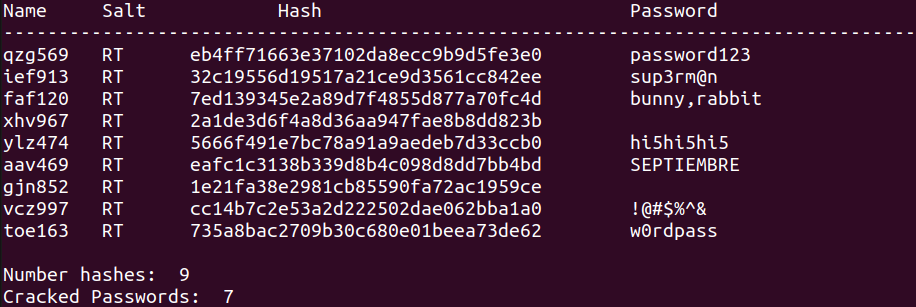

This program takes a selection of names and passwords stored in 'myshadow.txt' and simulates someone who has gained access to the Linux Shadow file where
username and passwords are stored. 

It trims the data of unnecessary characters and compares it to the 'RockYou5000.txt' which is a selection from the real 
RockYou password list. 

It then decrypts the usernames and passwords, if they are found in the RockYou file, displaying them in plaintext. 

